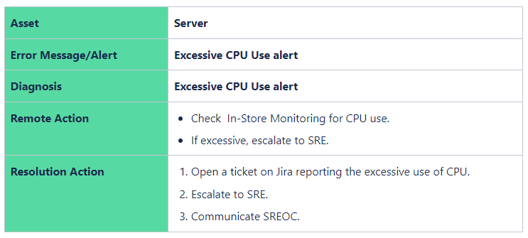
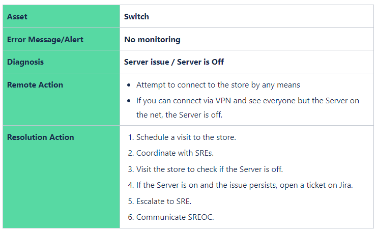

## Use Case

The company (let's call it _DoxHut_) was performing **PoCs** and running tests directly on what we can call a production environment. The software solution was implemented on a piece of software already established within the customer's facilities. Although it was _code_ injected in an application, it required various pieces of hardware installation and frequent maintenance.  
The challenge, however, was the team available to cover eventual incidents. Since we were **dealing with hardware**, on-site analysis was often inevitable. The team was mainly constituted of two levels:  
- **SREs**, in charge of controlling the servers' stability and, among other things, running a second level of analysis, usually requested by the Field Technicians, once they run the first instance of analysis and got confirmation on the issue not being related to the hardware installation's status.  
- **Field Technicians**, mostly constituted by interns, most of them part-time, and distributed across the country so that in-situ assistance was feasible.   💡 Contact **SRE's Team Leader** for further questions via Slack. 
> 📡 Is there anything missing? Reach out to our **Tech Writer** via Slack.

### On this Page

- [In-Store Monitoring Service](#in-store-monitoring-service)
  - [Connection Issue](#connection-issue)
  - [VPN is Down](#vpn-is-down)
- [NAS](#nas)
  - [NAS is Full](#nas-is-full)
  - [NAS Disconnected](#nas-disconnected)
  - [NAS Disk Broken](#nas-disk-broken)
- [Router](#router)
  - [Router is Broken](#router-is-broken)
  - [K3s Stopped](#k3s-stopped)
  - [LTE/Dongle Issue](#ltedongle-issue)
- [Server](#server)
  - [Internal Disc Full](#internal-disc-full)
  - [Excessive CPU Use Alert](#excessive-cpu-use-alert)
  - [High-Temperature Alarm](#high-temperature-alarm)
  - ["The Box is Disconnected" Message](#the-box-is-disconnected-message)
  - [Server not Recording](#server-not-recording)
  - [NAS is not Mounted](#nas-is-not-mounted)
  - [Wrong Time Settings](#wrong-time-settings)
  - [Excessive RAM Use](#excessive-ram-use)
- [Smart Power Supply](#smart-power-supply)
  - [Power Switch Unreachable (Not Shown/ No Message)](#power-switch-unreachable-not-shown-no-message)
  - [Outlets are Blocked (No Message)](#outlets-are-blocked-no-message)
- [Switch](#switch)
  - [Switch is Off](#switch-is-off)
  - [Server Issue / Server is Off](#server-issue--server-is-off)

## In-Store Monitoring Service
### Connection Issue

### VPN is Down

## NAS
### NAS is Full

### NAS Disconnected

### NAS Disk Broken

## Router
### Router is Broken

### K3s Stopped 

### LTE/Dongle Issue

## Server
### Internal Disc Full

### Excessive CPU Use Alert

### High-Temperature Alarm

### "The Box is Disconnected" Message

### Server not Recording

### NAS is not Mounted

### Wrong Time Settings

### Excessive RAM Use

## Smart Power Supply
### Power Switch Unreachable (Not Shown/ No Message)

### Outlets are Blocked (No Message)

## Switch
### Switch is Off

### Server Issue / Server is Off

[Back](./)
