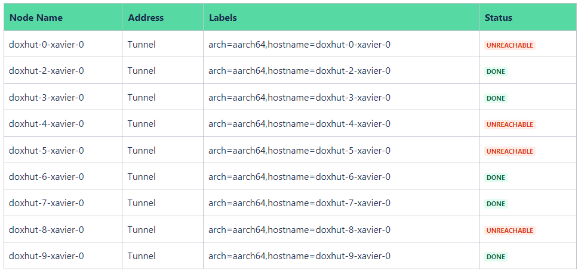

## On this Page:

- [Actions Required](#actions-required)
- [Prerequisites](#prerequisites)
- [Creating Passwords for Stores' Routers on LastPass](#creating-passwords-for-stores-routers-on-lastpass)
- [Accessing a Server](#accessing-a-server)
- [Setting SREs SSH RSA Keys](#setting-sres-ssh-rsa-keys)
- [Bonus: Setting Server’s Time](#bonus-setting-servers-time)

## Actions Required

- Create passwords and sections for servers on **LastPass**
- Access servers and change routers passwords
- Add **SREs' SSH RSA keys** to the routers authorized keys
- Set server time

## Prerequisites

- Having a **LastPass user**
- Having a **Teleport User**
- Having **Teleport installed**
- Having necessary **SSH RSA Keys**
- Knowing which servers to make changes to.

## Creating Passwords for Stores' Routers on LastPass

To create a section for each store’s router password on **LastPass**:

1. Access **DoxHut's LastPass Password Manager** panel.
2. Create a **New Item** by clicking the plus icon located at the bottom right corner. This action will open a modal where you must fill in a few fields.   
3. Fill in the **Name** field with the server’s name.
4. Fill in the **Folder** field with the “**Shared-stores**” value.
5. Fill in the **Username** with “**root**.”
6. Create a strong password (use the **LastPass' Generate Secure Password** tool).
7. Copy the password and paste it into the **Site Password** field.
8. Save this configuration by clicking **Save**.
9. Repeat the whole process for each of the servers listed below.

## Accessing a Server

To access a server:

1. List the existing servers by running:  
`tsh ls`  
   You will see all servers listed as shown next

2. Select a server and access it: 
`tsh ssh doxhut@doxhut-2-xavier-0` (example)

3. Then, access the router: 
`ssh root@192.168.1.1`

4. Once in the router, change its password by running: 
`passwd`

5. You will get a confirmation message and that’s it! 

## Setting SREs SSH RSA Keys

To set an SREs SSH RSA key in the router: 

1. Run: 
`cd /root`

2. List all directories: 
`ls -hal`

3. Open .ssh 
`cd .ssh`

4. Then, edit the authorized keys 
`vim authorized_keys`

5. Once on the **Vim editor**, press **“i”** to activate the editor mode. 

6. Paste one of the SSH RSA keys. 

7. Press **“Esc”** to exit edit mode. 

8. Press **“o”** to jump into the next line. 

9. Press **“i”** to activate the editor mode and paste a second key. 

10. Repeat as many times as keys you must insert in the file. 

11. Finally, make sure you are not in the editor mode, and press **“:wq”** to save changes and quit.  

## Bonus: Setting Server’s Time

Since you are already on the server, use the chance to set the server’s time by running:

`uci set system.ntp.enable_server='1' ; uci commit system ; /etc/init.d/sysntpd restart`

> 💡 **Note**: You will not get any confirmation message for this last step.  

[back](./)